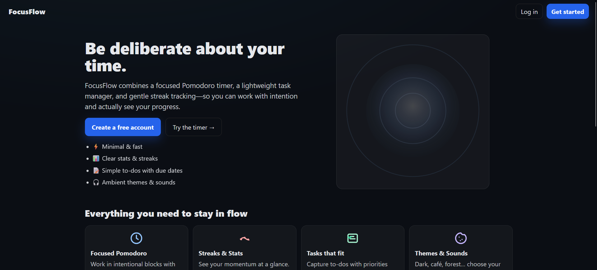
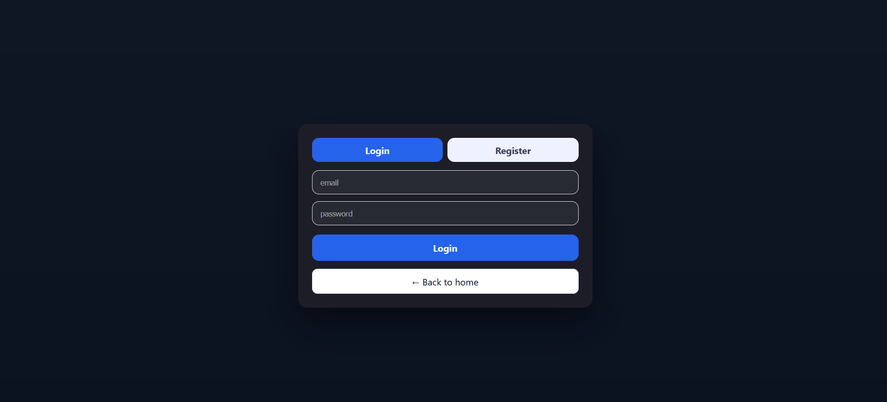
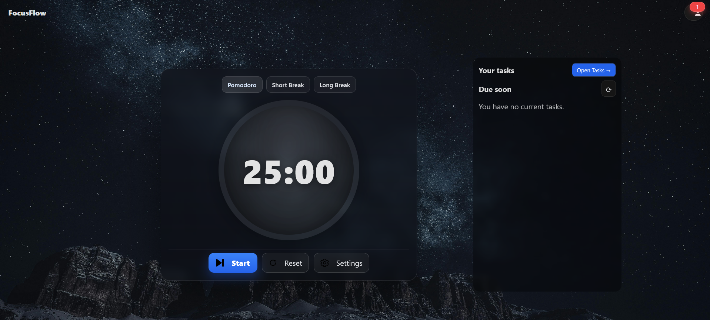
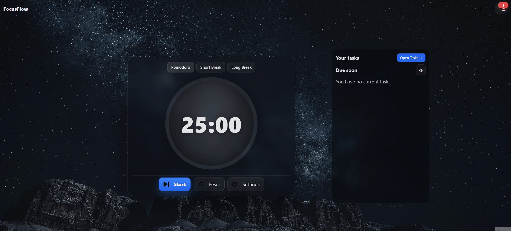
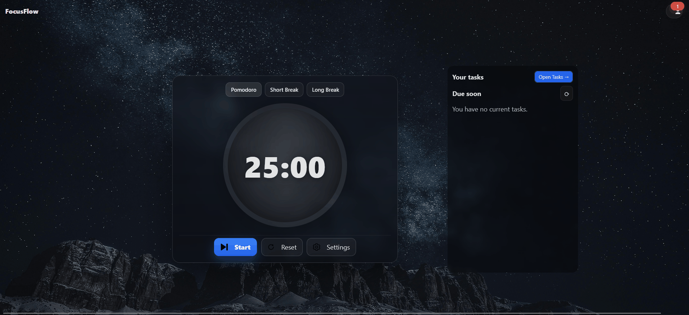
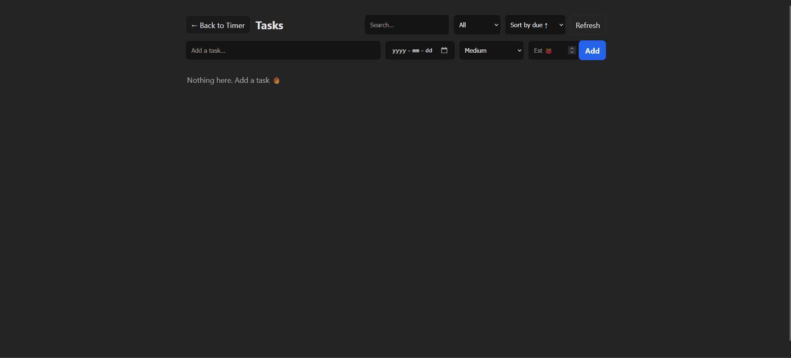
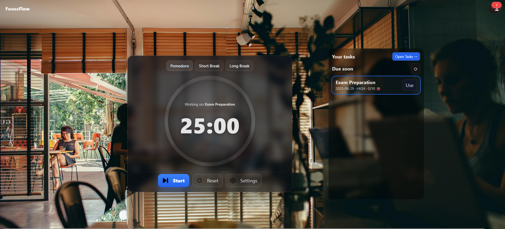
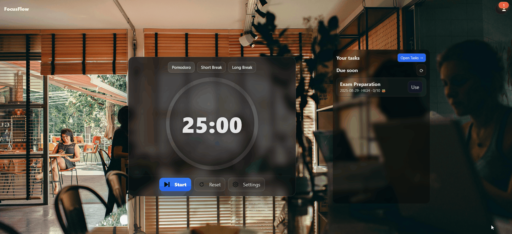
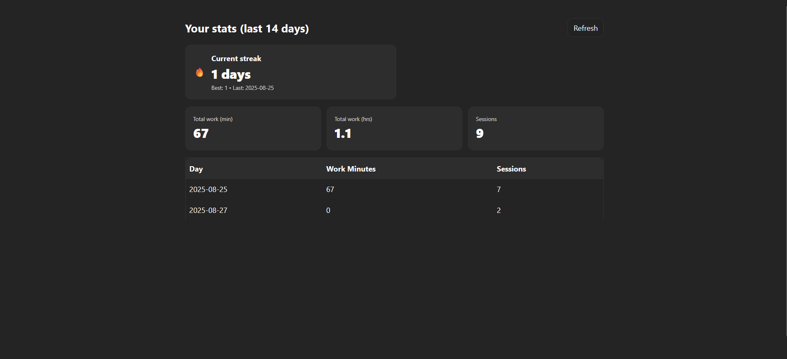

# Focus Flow

> Focus Flow is a full-stack productivity app that helps you stay focused, track your sessions, and manage your tasks — all in one place.
It combines the classic Pomodoro technique with a to-do manager, statistics dashboard, and streak tracking to keep you productive and aware of your progress.

## Features

- 🔑 User Authentication (JWT, bcrypt password hashing)

- ⏱️ Pomodoro Timer with customizable durations, themes, and alarm sounds

- 📊 Statistics Dashboard – track total minutes, sessions, and streaks

- 🔥 Streak Tracking – build consistency with daily work sessions

- ✅ Task Manager – create, prioritize, and complete tasks with due dates and Pomodoro estimates

- 🎨 Custom UI Themes (Dark, Rain, Forest, Café)

- 🔒 Secure API with JWT authentication, CORS enabled

## Tech Stack
### Frontend

- ⚛️ React (Vite)

- 🎨 Inline styled components & theme support

### Backend

- 🟢 Node.js + Express

- 🗄️ MongoDB + Mongoose

- 🔑 JWT Authentication

- 🔐 bcrypt for password hashing

- 🌐 CORS for secure cross-origin requests

## Screenshots / Demo
- Welcome Page

- Login/Register page

- Timer Page

- Open Settings

- Change Theme

- Open Tasks

- Add new task

- task on timer page

- go to profile page

- Stats page with streaks

## Installation
1. Clone repo
```
git clone https://github.com/zhantikpal4ik/Focus-Flow.git
cd Focus-Flow
```
2. Install server dependencies
```
cd server
npm install
```
3. Install client dependencies
```
cd ../client
npm install
```
4. Setup environment
```env
MONGODB_URI=mongodb://localhost:27017/focusflow
JWT_SECRET=your-secret-key
PORT=3000
```
5. Run server
```
cd server
node server.js
```
6. Run client
```
cd client
npm run dev
```
7. Open http://localhost:5173